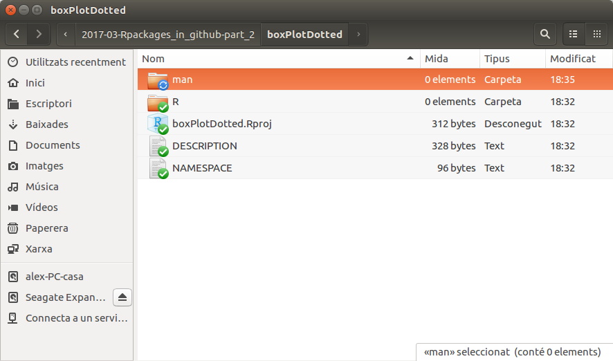

# De què va tot això?

- En aquest taller discutirem dues formes de treballar millor amb R (o, si més no de fer el que molts creiem que és millor ...)
    + Aprendrem a __crear paquets d'R__ de forma senzilla i ràpida
    + Aprendrem com __compartir el codi__ mitjançant el sistema de control de versions `Git` treballant en el repositori `Github`.
- I serem més feliços :-)    

# Perquè voldria jo fer paquets?

- Per tenir un codi més 
    + robust, 
    + extensible, 
    + reproduïble
- Bàsicament per __estalviar-nos temps__

# Perque treballar amb Sistemes de Control de Versions?

- Per tenir sempre la darrera versió
- Per compartir la meva feina, amb els demés però _també amb mi_ que puc accedir sempre al darrer que he fet desde qualsevol equip.
- Per disfrutar de l'ajuda que em dóna el feed-back d'una, dues, o potser milers de persones.

# Què ens cal?

## Per fer paquets

- Ens caldran alguns paquets.

```{r eval=FALSE}
if (! (require (devtools))) install.packages("devtools")
if (! (require (roxygen2))) install.packages("roxygen2")
if (! (require (testthat))) install.packages("testhat")
if (! (require (knitr))) install.packages("knitr")
```

- I algunes eines que es troben empaquetades a `RTools`
    + Per Windows les heu de descarregar [d'aqui:](https://cran.r-project.org/bin/windows/Rtools/)
    + Per Mac heu de tenir `XCode` instal·lat
    + En Linux a més de R, cal haver instal.lat les eines de desenvolupament d'R

---

## Per compartir-los amb Git/Github

- Caldrà que ens creem un compte a `GitHub` (la web des d'on compartirem el codi).

- Caldrà que instalem el programa `git` al nostre ordinador

  + [Instruccions per fer-ho](http://r-pkgs.had.co.nz/git.html)


---

## Una nota sobre el "com"

- Hi ha diverses formes de fer paquets.
- Clàssica: Google _"How to create R packages"_
    + Bottom-Up: Creant cada component i enllaçant-les 
    + Estil dels manuals de CRAN o del seminari de John Fox
- À la "Hadley-Wickam" 
    + Aprofitant eines de desenvolupament contingudes en Rstudio
    + [Writing an R package from scratch](https://hilaryparker.com/2014/04/29/writing-an-r-package-from-scratch/)
    + [Write an R Package from Scratch with Github](http://www.r-bloggers.com/write-an-r-package-from-scratch-with-github/)
    + Veieu: 
        - [El seu curs](http://courses.had.co.nz/12-devtools/).
        - [El seu llibre](http://r-pkgs.had.co.nz/)
---

# Pensem què volem fer
- En aquesta sessió treballarem _per l'exemple_:
    + Escolliu una funció senzilla amb la que voleu fer un paquet
    + Penseu un bon nom per al vostre paquet

- Un exemple naïve: `boxPlotWithDots` és una funció que permet visualitzar dues o més variables quantitatives amb punts i/o boxplots.

- Veurem com empaquetar-la però comencem *obtenint-la d'un repositori de github*:

---

# Una funció d'exemple

```{r}
# source("https://raw.githubusercontent.com/alexsanchezpla/scripts/master/usefulFunctions/boxplotWithDots.R")
boxplotWithDots<- function (myExpres, lev, aTitle, groupLabels, addBoxplot=TRUE, pchVal=16, colVal=rainbow(8))
{
  beeswarm(myExpres~lev, 
           ylab="Expression", xlab="Groups",
           main=aTitle,
           labels=groupLabels,
           pch = pchVal, col = colVal)  
  if(addBoxplot)
    boxplot(myExpres~lev, add = T, names = c("",""), col="#0000ff22")
  # Segons un post de: https://www.r-statistics.com/2011/03/beeswarm-boxplot-and-plotting-it-with-r/
}
```
---

# Exemple d'ús

```{r}
require(beeswarm)
expres <-c(rnorm(10,5,2), rnorm(10,10,2))
trat <- as.factor(c(rep("CT",10), rep("TR",10)))
titol <- "Treatment effect"
groupLab<- c("Control", "Treatment")
boxplotWithDots(myExpres=expres, lev=trat, aTitle=titol, groupLabels=groupLab)
```
---

# Creació de l'esquelet d'un paquet

- Des de la consola:

```{r eval=FALSE}
setwd("~/OnVolguemCrearElPaquet")
if(!require(devtools)) install.packages("devtools")
require(devtools)
create("boxPlotDotted")
```

- Amb Rstudio
    + Obrim RStudio
    + Creem un nou projecte: `File -> New Project`
    + Escollim `New Directory`
    + Escollim `R Package`
    + Escollim el directori on volem que es creï el paquet
    + Donem un nom al paquet i cliquem a "Create Project"
    
---

# Resultat: L'esquelet del paquet



- Revisem què és cada cosa

# Afegim la documentació

- Tradicionalment era un "rotllo", lent de fer, i fàcil de cometre errors.
- El paquet `roxygen2` ho ha fet patèticament senzill.
- Bàsicament l'ajuda consisteix en posar uns comentaris a l'encapçalament del paquet
- Els comentaris poden començar per:
    - @param
    - @keywords
    - @seealso
    - @export
    - @examples
- El que els fa atractiu aquest sistema es que és __gairebé el mateix que faríem sense fer el paquet__
 
---   

## L'arxiu documentat

```{r eval=FALSE}
#' boxplotWithDots
#'#' This function allows plotting a dotplot and eventually overplotting a boxplot on it
#'#' @param myExpres Numeric values
#' @param lev A factor for drawing the plot as plot(expres~lev). Pay attention to the order of values in the expres vector and levels in the factor
#' @param aTitle The title for the plot
#' @param groupLabels Names for the groups
#' @param addBoxplot Define if a boxplot has to be overdrawn (set to TRUE when the number of points is big enough)
#' @importFrom graphics boxplot
#' @importFrom beeswarm beeswarm
#' @examples
#' expres <-c(rnorm(10,5,2), rnorm(10,10,2))
#' trat <- as.factor(c(rep("CT",10), rep("TR",10)))
#' titol <- "Treatment effect"
#' groupLab<- c("Control", "Treatment")
#' boxplotWithDots(myExpres=expres, lev=trat, aTitle=titol, groupLabels=groupLab)
#' @export
boxplotWithDots<- function (myExpres, lev, aTitle, groupLabels, addBoxplot=TRUE){
  beeswarm(myExpres~lev,
           ylab="Expression", xlab="Groups",
           main=aTitle,
           labels=groupLabels)
  if(addBoxplot)
    boxplot(myExpres~lev, add = T, names = c("",""), col="#0000ff22")
  # Segons un post de: https://www.r-statistics.com/2011/03/beeswarm-boxplot-and-plotting-it-with-r/
}
```

# Processem la documentació

- Per crear la documentació en format "estàndar" l'única cosa que ens cal ara es fer:
```{r eval=FALSE}
setwd("boxPlotDotted")
require(devtools)
document()
```
- Mirem al directori 'man' que s'hi ha posat

# Revisem l'arxiu DESCRIPTION

- Conté informació bàsica bastant intuïtiva

```{r eval=FALSE}
Package: boxPlotDotted
Title: What the Package Does (one line, title case)
Version: 0.0.0.9000
Authors@R: person("First", "Last", email = "first.last@example.com", role = c("aut", "cre"))
Description: What the package does (one paragraph).
Depends: R (>= 3.3.2)
License: What license is it under?
Encoding: UTF-8
LazyData: true
RoxygenNote: 6.0.1

```

---

- La canviem per la informació del nostre paquet

```{r eval=FALSE}
Package: boxPlotDotted
Type: Package
Title: Diagrames de punts i de capsa
Version: 0.1.1
Author: Alex Sanchez
Maintainer: Alex Sanchez <asanchez@ub.edu>
Description: Aquest paquet ens servira per fer un boxplot, un dotchart o tots dos superposats (segons el nombre de punts podem decidir)
License: GPL 2
LazyData: TRUE
RoxygenNote: 6.0.1
```

Veieu [en aquest enllaç](http://r-pkgs.had.co.nz/description.html) mes informació sobre aquest arxiu i com modificar-lo.

# I ja el podem instal·lar

- Ens col·loquem al directori d'on penja el directori del paquet
```{r eval=FALSE}
setwd("..")
```
- I executem la instrucció `install()`
```{r eval=FALSE}
require(devtools)
install("boxPlotDotted")
```

# Provem el paquet

```{r eval=FALSE}
require(boxPlotDotted)
expres <-c(rnorm(10,5,2), rnorm(10,10,2))
trat <- as.factor(c(rep("CT",10), rep("TR",10)))
titol <- "Treatment effect"
groupLab<- c("Control", "Treatment")
opt<- par(pch=2)
# boxplotWithDots(myExpres=expres, lev=trat, aTitle=titol, groupLabels=groupLab)
```

# _I ara una mica de pràctica_

- Escollim la funció amb la que treballarem.
    + Suposarem que es diu `unaFuncio` i està continguda en l'arxiu `unaFuncio.R`.
- Repetim pas a pas el procés de creació del paquet a partir de la funció que hem aportat.
```{r eval=FALSE}
setwd("~/elMeuDirectoriDeTreball")
require(devtools)
create("unPaquet")
setwd("unPaquet")
# Copiem l'arxiu `unaFuncio.R` al directori R
# Documentem la funció amb el sistema de Roxygen 
document()
setwd("..")
# L'instal·lem
install("unPaquet")
```
---
# Introducció als Sistemes de Contol de Versions

## Manteniment i distribució de codi amb SCV

SCV = "Sistemes de Control de Versions"

<div align="center">

</div>

---

## Què són els SCV?

- S'anomena __control de versions__ a la gestió dels diversos canvis que es realitzen sobre els elements d'algun producte o una configuració del mateix. 
- Una _versió_, revisió o edició d'un producte, és l'estat en què es troba el mateix en un moment donat del seu desenvolupament o modificació.
- Els _sistemes de control de versions_ son __programes__ que faciliten l'administració de les diferents versions de cada producte desenvolupat.
    + Un _producte_ pot ser un arxiu, un paquet, un projecte sencer, ...

---

## Què aporten els SCV?

- Un sistema de control de versions ha de proporcionar:
    + Un _mecanisme d'emmagatzematge_ dels elements que hagi de gestionar (p.ex. Arxius de text, imatges, documentació ... ).
    + La _possibilitat de realitzar canvis_ sobre els elements emmagatzemats (p, ex. Modificacions parcials, afegir, esborrar, canviar el nom o moure elements).
    + Un _Registre històric_ de les accions realitzades amb cada element o conjunt d'elements (normalment podent tornar o extreure un estat anterior del producte).
- Un concepte important és el de __repositori__ que és com s'anomena al _lloc on s'emmagatzemen les dades actualitzades i històrics de canvis_, sovint en un servidor. 
    + Pot ser un sistema d'arxius en un disc dur, un banc de dades, etc.
    
---

# Tipus de SCV

- Podem classificar els sistemes de control de versions atenent a l'arquitectura utilitzada per a l'emmagatzematge del codi
    + __Centralitzats__: existeix un repositori centralitzat de tot el codi, del qual és responsable un únic usuari ( o conjunt d'ells). Es faciliten les tasques administratives a canvi de reduir flexibilitat , ja que totes les decisions fortes ( com crear una nova branca ) necessiten l'aprovació del responsable.  Alguns exemples són __CVS__, __Subversion__ o __Team Foundation Server__.
    + __Distribuïts__: cada usuari té el seu propi repositori. Els diferents ubicacions poden intercanviar i barrejar revisions entre ells. És freqüent l'ús d'un repositori, que està normalment disponible, que serveix de punt de sincronització dels diferents ubicacions locals. Alguns exemples són __Bazaar__ o __Git__,
    
<div align="center">

</div>

---

# Què és `Github`?

- `GitHub` és un servei de hosting de repositoris `Git`.
- `GitHub` ofereix tota la funcionalitat de `Git` de control de revisió distribuït i administració de codi de la font (SCM) afegint una sèrie de característiques pròpies. 
    + A diferència de `Git`, que és estrictament una eina de _línia de comandes_, `GitHub` proporciona una interfície gràfica basada en web i escriptori així com integració del mòbil. 
    + També proporciona control d'accés i diverses característiques de col·laboració com _`bug tracking`_, _administració de tasques_, i _wikis_ per cada projecte.

<div align="center">

</div>

---

# Per a que sol fer-se servir Git/Github?

- Si es desa el codi en un repositori
    + És més facil controlar els canvis que es van introduïnt
    + És més senzill accedir (un mateix i altres) a la darrera versió.
    + És possible treballar colaborativament.
- Els desenvolupadors de programes poden ...
    + Tenir control del que van desenvolupant.
        - Versions de desenvolupament / Versions estables
    + Distribuir més fàcilment les versions estables
    + Rebre input dels usuaris dels programes
- Els usuaris dels programes poden ...
    + Accedir a la darrera versió dels programes que volen fer servir.
    + Donar feedback als desenvolupadors dels programes.
    
---

# Configuració inicial

- Convé diferenciar la configuració de `Git` de la de `Github`
- `Git` és el programa que permet fer el CV i s'ha d'instal·lar
- `Github` és l'entorn web que adoptem per fer-ho i ens hi hem de donar d'alta.
- Com probablement farem servir Rstudio també el configurarem

Recordem que: 
- Per *accedir* a un repositori i descarregar-ne el material no cal res especial.
- Sí que cal si es vol posar codi (o altres  materials) sota control de versions.

---

# Creació d'un compte a Github

- Anar a [https://github.com/](https://github.com/) i crear-hi un usuari
    + [https://github.com/miriammota](https://github.com/miriammota)
    + [https://github.com/hadley](https://github.com/hadley)
    + [https://github.com/alexGRBio](https://github.com/alexGRBio)
- És gratuït si volem emprar repositoris públics
- Podem obtenir espai per repositoris privats
    + A [Github](https://github.com) amb llicència acdèmica o pagant una quota petita.
    + Gratuitament a altres llocs com [Gitlab](https://gitlab.com)
- Podem crear Organitzacons que agrupin usuaris
    + [https://github.com/GRBio](https://github.com/GRBio)
    + [https://github.com/uebueb](https://github.com/uebueb)
   
--- 

# Instalacio de Git

- Podem veure com instalar Git en l'enllaç:
[ http://r-pkgs.had.co.nz/git.html#git-init](http://r-pkgs.had.co.nz/git.html#git-init)

- Bàsicamet cal fer: 
    + Descarregar el programa
    + Instalar-lo
    + Configurar el nom d'usuari: des de consola escriurem:
    
      `git config --global user.email  alex@grbio.eu`
      
      `git config --global user.name  alexGRBio`  

---

# Configuració de Rstudio per treballar amb Git/Github

[http://www.r-bloggers.com/rstudio-and-github/](http://www.r-bloggers.com/rstudio-and-github/)

- Des de _Tools -> Version Control_ selecionem _Git_
- Des de _RStudio, Tools -> Global Options_, seleccionem la pestanya _Git//SVN_
    + Cal assegurar-se que el _path_ cap a l'executable és correcte, especialment a Windows on és del tipus ' C:/Program Files (x86)/Git/bin/git.exe`.
- Escollim _Create RSA Key_
- Tanquem la finestra, cliquem _View public key_ i copiem la clau pública que se'ns mostra.
- _(Si encara no tinguessim un compte de github ara és el moment de crear-lo(_
    - Obrim _account settings_, 
    - cliquem la pestanya de claus SSH
    - Cliquem _Add SSH key_
    - Enganxem la clau pública que hem creat des de Rstudio.
- Hem d'identificar-nos a Git (que està al nostre ordinador!, no és github)
    - A RStudio, cliquem _Tools -> Shell_
    - S'obre una consola on escriurem:

      `git config --global user.email  alex@grbio.eu`
      
      `git config --global user.name  alexGRBio`  

---

# Cas 1: Creació de projectes amb control de versió

- Com abans escollim _New project_ i després _New Directory_
- Donem nom al projecte i marquem: _Create a git repository_
- Des de RStudio, creem un nou script (`test.R`) que afegirem al repositori
    + Un cop gravat aquest nou script (`test.R`), apareixerà a la pestanya Git tab del plafo `Environment / history`.
    + Selecciona el(s) arxius que vulguis afegir al repositori i apreta `Commit` entrant una breu descripció on diu `Commit message`.
        + Hem enviat ("committed") la versió actual de l'arxiu al teu repositori local, el teu ordinador o servidor.
        + Ara voldriem pujar ("push") el resultat de l'enviament  ("commit") a GitHub, de forma que 
            + En tenim una còpia de seguretat
            +  Serà accessible als colaboradors

---

# Cas 2: Convertir un directori local en un repositori de Github

- Si volem convertir un repositori local en un remot ho hem de fer mitjançant linia de comandes.
- Un cop fet aix ò podrem "empènyer" el repositori a github ...
    + Sense haver creat un directori remot que es correspongui
    + Havent creat prèviament un directori remot amb el qual enllaçar.
- Un cop creat el directori a GitHub hi podrem afegir arxius

# 2.1 Creació del repositori remot

- Suposem que tenim un directori local que volem posar a Github
- En primer lloc el convertirem en repositori i farem un repositori remot a imatge seva

```{r eval=FALSE}
echo "# 2017-02-09-MyFebruary_Talk" >> README.md
git init
git add README.md
git commit -m "first commit"
git remote add origin https://github.com/alexsanchezpla/-MyFebruary_Talk.git
git push -u origin master
```
---

# 2.2 Afegint arxius del repositori local al remot

- Amb el repositori remot creat hi podem afegir arxius

```{r eval = FALSE}
git add -A
git commit -m "Nos arxius afegits"
git push -u origin master
```

- Cada cop que fem canvis i els vulguem actualitzar podem repetir aquestes instruccions.

---

# Cas 3: Creació d'un paquet sota control de versions

- Si el procés que hem seguit anteriorment per crear el paquet l'haguessim fet dins d'un projecte d'R sota control de versions podríem haver-lo pujat directament a github
- Des d'allà tothom que ho vulgui s'ho pot instalar o clonar.

# Cas 3: Clonar un repositori de Github

- Si volem descarregar-nos un repositori podem fer-ho
    + A github ens posem al repositori
    + Seleccionem l'opció `Clone/download'
    + Al nostre ordinador ens posem a la carpeta on volem que es posi el repositori clonat
    + Fem: `git clone nomRepositori`
    
- Podem fer-ho també des de Rstudio

# Referencies i enllaços

- [Seminari impartit per Xavier de Pedro a la UEB al VHIR: *Enhance your Team Work with DVCS: Bazaar, Git...*](http://ueb.vhir.org/SeminarDVCS)
- [Seminari impartit per Miriam Mota al VHIR](http://ueb.vhir.org/2016-02-19+Miriam+Mota+Git-Github)


        
        
    

