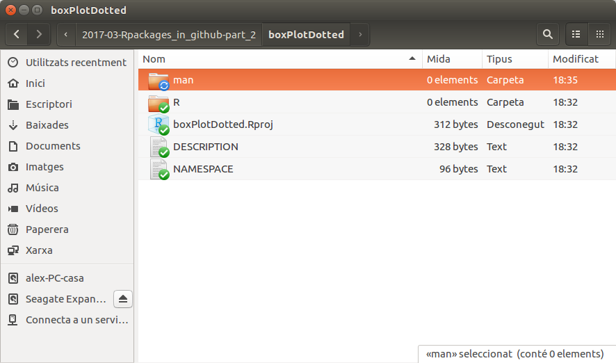

# ¿De qué va todo esto?

- En estos talleres discutiremos dos formas de trabajar mejor con R (o, al menos de hacer lo que muchos creemos que es mejor ...)

    + Aprenderemos a __crear paquetes de R__ de forma sencilla y rápida
    + Aprenderemos como __compartir el código__ mediante el sistema de control de versiones `Git` trabajando en el repositorio` Github`.
    
- Y seremos más felices :-)

# Porque quisiera yo hacer paquetes?

- Para tener un código más
    + Robusto,
    + Extensible,
    + reproducible
- Básicamente para __hacer programas mejores__ y __ahorrar tiempo__

# Porque trabajar con Sistemas de Control de Versiones?

- Para disponer de un sistema de seguimiento y recuperación de las sucesivas versiones de lo que estamos desarrollando.
- Para que yo y quien lo desee pueda siempre acceder a la última versión (o a versiones anteriores).
- Para compartir mi trabajo con los demás pero _también conmigo_  ya que puedo acceder siempre a mi trabajo desde cualquier equipo.

---

# ¿Qué necesitamos para hacer paquetes?

- Nos harán falta algunos paquetes.

```{r eval = FALSE}
if (! (require (DevTools))) install.packages ( "DevTools")
if (! (require (roxygen2))) install.packages ( "roxygen2")
if (! (require (testthat))) install.packages ( "testhat")
if (! (require (knitr))) install.packages ( "knitr")
```

- Y algunas herramientas que se encuentran empaquetadas en `RTools`
    + Para Windows las debe descargar [de aqui:](https://cran.r-project.org/bin/windows/Rtools/)
    + Para Mac debe tener `XCode` instalado
    + En Linux además de R, es necesario haber instalado las herramientas de desarrollo de I

---

# ¿Qué necesitamos para compartirlos por Git / Github?

- Creareamos una cuenta en `GitHub` (la web desde donde compartiremos el código).

- Instalaremos el programa `git` en nuestro ordenador

  [Instrucciones para hacerlo](http://r-pkgs.had.co.nz/git.html)

---

# Una nota sobre el "cómo"

- Hay varias formas de hacer paquetes.
- Clásica: Google _ "How to create R packages" _
    + Bottom-Up: Creando cada componente y enlazándolas
    + Estilo de los manuales de CRAN o del seminario de John Fox
- À la "Hadley-Wickam"
    + Aprovechando herramientas de desarrollo contenidas en Rstudio
    + [Writing an R package from scratch] (https://hilaryparker.com/2014/04/29/writing-an-r-package-from-scratch/)
    + [Write an R Package from Scratch with Github] (http://www.r-bloggers.com/write-an-r-package-from-scratch-with-github/)
 --

# Primer paso: Pensemos qué queremos hacer

- En esta sesión trabajaremos _con un ejemplo_:
    + Empezamos escogiendo __una__ función sencilla con la que crearemos un paquete
    + Vale la pena perderr 5 min. pensando en  un buen nombre para su paquete
- Un ejemplo naïve: 
    + Empaquetaremos una función que permite visualizar dos o más variables cuantitativas con puntos y / o boxplots.
    + La llamaremos `boxPlotWithDots` 
    + Para facilitar el ejemplo la  *recuperaremos de un repositorio de GitHub*:

---

# Una función de ejemplo

```{r}
# source ( "https://raw.githubusercontent.com/alexsanchezpla/usefulFunctions/master/boxplotWithDots.R")
boxplotWithDots <- function (myExpres, lev, aTitle, groupLabels, addBoxplot=TRUE)
{
  beeswarm(myExpres~lev, 
           ylab="Expression", xlab="Groups",
           main=aTitle,
           labels=groupLabels)  
  if(addBoxplot)
    boxplot(myExpres~lev, add = T, names = c("",""), col="#0000ff22")
  # Segons un post de: https://www.r-statistics.com/2011/03/beeswarm-boxplot-and-plotting-it-with-r/
}
```
---

# Ejemplo de uso

```{r, message = FALSE}
library (beeswarm)
expres <-c (rnorm (10,5,2), rnorm (10,10,2))
trado <- as.factor (c (rep ( "CT", 10), rep ( "TR", 10)))
titulo <- "Treatment effect"
groupLab <- c ( "Control", "Treatment")
boxplotWithDots (myExpres = expres, lev = trado, aTitle = titulo, groupLabels = groupLab)
```
---
# Etapas en la creación de un paquete

Aunque el orden se puede modificar una forma de crear paquetes *utilizando las herramientas de Hadley Wickam* puede ser la siguiente:

## Pasos imprescindibles

1. Creación del esqueleto del paquete.
2. Creación de las funciones y documentación de estas con `Roxygen`
3. Actualización de la información de los archivos DESCRIPTION y NAMESPACE
4. Creación del paquete ( "compilación")

---

## Pasos opcionales

1. Creación de un manual mediante una "Vignette" [http://r-pkgs.had.co.nz/vignettes.html](http://r-pkgs.had.co.nz/vignettes.html)
2. [Antes del punto 4] Creación y depósito de los datos de ejemplo *
3. [Después del punto 4] Depósito ( "upload") del paquete a GitHub para hacerlo accesible a los potenciales usuarios
4. [Después del punto 4] Instalación del paquete desde los archivos locales o desde `github`.

---

# 1. Creación del esqueleto del paquete

Muchas de las acciones que describiremos pueden ejecutarse desde la consola o usando el sistema de menus de rstudio

## Creación de un paquete desde la consola.


```{r, eval = FALSE}
setwd ( "~ / OnVolguemCrearElPaquet")
if (! require (DevTools)) install.packages ( "DevTools)
require (DevTools)
create ( "boxPlotDotted")
```
---

## Creación de un paquete mediante el sistema de menus

+ Abrimos RStudio
+ Creamos un nuevo proyecto: `File -> New Project`
+ Escogemos `New Directory`
+ Escogemos `R Package`
+ Elegimos el directorio donde queremos que se cree el paquete
+ Damos un nombre al paquete y hacemos clic en "Create Project"

---

# 1.2 Resultado: El esqueleto del paquete



---

# 2. Añadimos la documentación

- Tradicionalmente, lento de hacer, y fácil  de cometer errores.
- El paquete `roxygen2` lo ha hecho más sencillo.
- Sólo hace falta poner unos comentarios en el encabezamiento del paquete.
- Los comentarios pueden empezar por:
    - @param
    - @keywords
    - @seealso
    - @export
    - @examples
- Lo que los hace atractivo este sistema es que es son casi las mismas operaciones si no quisiéramos hacer un paquete pero s'documentar lo que hacemos.

---

## 2.1 Aspecto del archivo documentado

```{r, eval = FALSE}
# 'BoxplotWithDots
# '#' This function Allows Plotting a Dotplot and eventually overplotting a boxplot on it
# '#' @param myExpres Numeric values
# '@param lev A factor for drawing the plot as plot (ex ~ lev). Pay attention to the order of values ??in the express vector and levels in the factor
# '@param aTitle The title for the plot
# '@param groupLabels Names for the groups
# '@param addBoxplot Define if a boxplot has to be overdrawn (siete to TRUE when the number of points is big enough)
# '@importFrom graphics boxplot
# '@importFrom beeswarm beeswarm
# '@examples
# Ex preso <-c (rnorm (10,5,2), rnorm (10,10,2))
# 'Trado <- as.factor (c (recibe ( "CT", 10), recibe ( "TR", 10)))
# 'Titulo <- "Treatment effect"
# 'GroupLab <- c ( "Control", "Treatment")
# 'BoxplotWithDots (myExpres = expres, lev = trado, aTitle = titulo, groupLabels = groupLab)
# '@export
boxplotWithDots <- function (myExpres, lev, aTitle, groupLabels, addBoxplot = TRUE) {
beeswarm (myExpres ~ lev,
ylab = "Expression", xlab = "Groups",
main = aTitle,
labels = groupLabels)
if (addBoxplot)
boxplot (myExpres ~ lev, add = T, names = c ( "", ""), col = "# 0000ff22")
# Según un post de: https://www.r-statistics.com/2011/03/beeswarm-boxplot-and-plotting-it-with-r/
}
```

# 2.2 Procesamos la documentación

- Para crear la documentación en formato "estándar" lo único que necesitamos ahora se hacer:
```{r eval = FALSE}
setwd ( "boxPlotDotted")
require (DevTools)
documento ()
```
- En el directorio `man` debería haber aparecido un archivo de ayuda:` boxPlotDotted.Rda`.

---

# 3.1 Revisión del archivo DESCRIPTION

- El archivo DESCRIPTION contiene información sobre diversos aspectos del paquete, la mayoría bastante intuitiva

```{r, eval = FALSE}
Package: boxPlotDotted
Title: What the Package Does (one line, title case)
Version: 0.0.0.9000
Authors @ R: person ( "First", "Last", email = "first.last@example.com", role = c ( "aut", "cree"))
Description: What the package does (one paragraph).
Depends: R (> = 3.3.2)
License: What license is it under?
Encoding: UTF-8
LazyData: true
RoxygenNote: 6.0.1
```

- Esta información se actualizará

---

# 3.2 Actualización del archivo DESCRIPTION

- La cambiamos por la información de nuestro paquete

```{r, eval = FALSE}
Package: boxPlotDotted
Type: Package
Title: Diagramas de puntos y de caja
Version: 0.1.1
Author: Alex Sanchez
Maintainer: Alex Sanchez <asanchez@ub.edu>
Description: Este paquete nos servirá para hacer un diagrama de caja, `boxplot`, un diagrama de puntos,` dotchart, o ambos superpuestos (según el número de puntos podemos decidir).
License: GPL 2
LazyData: TRUE
RoxygenNote: 6.0.1
```

Ver [en este enlace](http://r-pkgs.had.co.nz/description.html) mas información sobre este archivo y cómo modificarlo.

---

# 3.3 Revisión del archivo NAMESPACE

- Cuando se carga un paquete con `library ()` sólo se ponen en memoria los objetos que han sido "exportados"

- En este archivo se indica los objetos que se desea exportar lo que los hará directamente visibles

    + Los objetos exportados deben tener ayuda
    + Los objetos no exportados no necesitan estar documentados

- Para exportar dos objetos a, b utilizaremos: `export (a, b)`

- La opción por defecto es exportar todo con esta instrucción:

    + `ExportPattern (" ^ [^ \ \.] ")`

---

# 4. Compilación e Instalación

- Tradicionalmente se hace por separado.

- La instrucción `install` del paquete` DevTools () `combina las dos

Nos colocamos en el directorio de donde cuelga el directorio del paquete

```{r, eval = FALSE}
setwd ( "..")
```

Y ejecutamos la instrucción `install ()`

```{r, eval = FALSE}
require (DevTools)
install ( "boxPlotDotted")
```

---

# 4.2 Probamos el paquete

```{r, eval = FALSE}
require (boxPlotDotted)
expres <-c (rnorm (10,5,2), rnorm (10,10,2))
trado <- as.factor (c (recibe ( "CT", 10), recibe ( "TR", 10)))
titulo <- "Treatment effect"
groupLab <- c ( "Control", "Treatment")
opt <- par (PCH = 2)
# BoxplotWithDots (myExpres = expres, lev = trado, aTitle = titulo, groupLabels = groupLab)
```

# _Y ahora un poco de pràctica_

- Elegimos la función con la que trabajar. Supondremos que se llama `unaFuncion` y está contenida en el archivo ` unaFuncion.R`.
    + __NOTA:__ _Aquí podéis usar la función que deseéis. El ejemplo no contienen ninguna_
- Repetimos paso a paso el proceso de creación del paquete a partir de la función que hemos aportado.

```{r, eval = FALSE}
setwd ( "~ / elMeuDirectoriDeTreball")
library (DevTools)
create ( "unPaquete")
setwd ( "unPaquete")
# Copiamos el archivo `unaFuncion.R` el directorio R
# Documentamos la función con el sistema de Roxygen
document()
setwd( "..")
# La instalamos
install ("unPaquete")
```

# Referencias y enlaces

- [Libro sobre creación de paquetes] (http://r-pkgs.had.co.nz/)
- [Curso sobre creación de paquetes] (http://courses.had.co.nz/12-devtools/)

