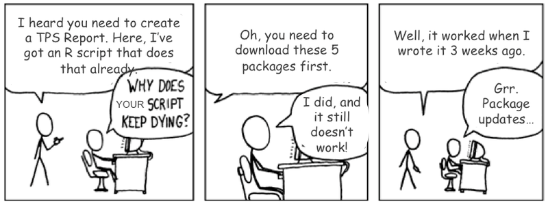

# Introducción a los Sistemas de Contol de Versiones


SCV = "Sistemas de Control de Versiones"

<div align="center">

</div>

---

## ¿Qué son los SCV?
<br>

- Se llama __control de versiones__ a la gestión de los diversos cambios que se realizan sobre los elementos de algún producto o una configuración del mismo.
- Una _versión_, revisión o edición de un producto, es el estado en que se encuentra el mismo en un momento dado de su desarrollo o modificación.
- Los __Sistemas de control de versiones (SCV)__ son __programas__ que facilitan la administración de las diferentes versiones de cada producto desarrollado.
- Un _producto_ puede ser un archivo, un paquete, un proyecto entero.

---

## ¿Qué aportan los SCV?

- Un sistema de control de versiones debe proporcionar:
    + Un _mecanismo de almacenaje_ los elementos que tenga que gestionar (p.ej. Archivos de texto, imágenes, documentación ...).
    + La _posibilidad realizar cambios_ sobre los elementos almacenados (p, ej. Modificaciones parciales, añadir, borrar, renombrar o mover elementos).
    + Un _Registre histórico_ de las acciones realizadas con cada elemento o conjunto de elementos (normalmente pudiendo volver o extraer un estado anterior del producto).
- Un concepto importante es el de __repositorio__ que es como se denomina al lugar donde se almacenan los datos actualizados e históricos de cambios.
- Un repositorio puede tomar formas muy distintas: puede ser un sistema de archivos en un seridor web, en un disco duro, un banco de datos, etc.

---

# Tipo de SCV

- Podemos clasificar los sistemas de control de versiones atendiendo a la arquitectura utilizada para el almacenamiento del código
    + __Centralitzados__: existe un repositorio centralizado de todo el código, del que es responsable un único usuario (o conjunto de ellos). Se facilitan las tareas administrativas a cambio de reducir flexibilidad, ya que todas las decisiones fuertes (como crear una nueva rama) necesitan la aprobación del responsable. Algunos ejemplos son __CVS__, __Subversion__ o __Team Foundation Server__.
    + __Distribudos__: cada usuario tiene su propio repositorio. Los diferentes ubicaciones pueden intercambiar y mezclar revisiones entre ellos. Es frecuente el uso de un repositorio, que está normalmente disponible, que sirve de punto de sincronización de los diferentes ubicaciones locales. Algunos ejemplos son __Bazaar__ o __Git__,

<div align = "center">

</div>

---

# ¿Qué es `Github`?

- `GitHub` es un servicio de hosting de repositorios` Git`.
- `GitHub` ofrece toda la funcionalidad de` Git` de control de revisión distribuido y administración de código de la fuente (SCM) añadiendo una serie de características propias.
- A diferencia de `Git`, que es estrictamente una herramienta de _línea de comandes_,` GitHub` proporciona una interfaz gráfica basada en web y escritorio así como integración del móvil.
- También proporciona control de acceso y varias características de colaboración como _`bug tracking`_, _administración de tasques_, y _wikis_ por cada proyecto.

<Div align = "center">

</Div>

---

# Para que suele utilizarse Git / Github?

- Si se guarda el código en un repositorio
    + Es más fácil controlar los cambios que se van introduciendo
    + Es más sencillo acceder (uno mismo y otros) a la última versión.
    + Es posible trabajar colaborativamente.
- Los desarrolladores de programas pueden ...
    + Tener control de lo que van desarrollando.
        - Versiones de desarrollo / Versiones estables
    + Distribuir más fácilmente las versiones estables
    + Recibir input de los usuarios de los programas
- Los usuarios de los programas pueden ...
    + Acceder a la última versión de los programas que quieren utilizar.
    + Dar feedback a los desarrolladores de los programas.
    
---

# Configuración inicial

- Conviene diferenciar la configuración de `Git` de la de` Github`
- `Git` es el programa que permite hacer el CV y ??se instalará
- `Github` es el entorno web que adoptamos para hacerlo y hay que darse de alta.
- Como probablemente utilizaremos Rstudio también el configuraremos

Recordemos que:
- Para * acceder * a un repositorio y descargar su material no hay nada especial.
- Sí que hay si se quiere poner código (u otros materiales) bajo control de versiones.

---

# Creación de una cuenta en Github

- Ir a [https://github.com/](https://github.com/) y crear un usuario
    + [Https://github.com/miriammota](https://github.com/miriammota)
    + [Https://github.com/hadley](https://github.com/hadley)
    + [Https://github.com/alexGRBio](https://github.com/alexGRBio)
- Es gratuito si queremos emplear repositorios públicos
- Podemos obtener espacio para repositorios privados
    + A [Github] (https://github.com) con licencia acdèmica o pagando una cuota pequeña.
    + Gratis a otros sitios como [Gitlab] (https://gitlab.com)
- Podemos crear Organitzacons que agrupen usuarios
    + [Https://github.com/GRBio](https://github.com/GRBio)
    + [Https://github.com/uebueb](https://github.com/uebueb)
   
---

# Instalación de Git

- Podemos ver cómo instalar Git en el enlace:
[Http://r-pkgs.had.co.nz/git.html#git-init](http://r-pkgs.had.co.nz/git.html#git-init)

- Básicamente hay que hacer:
    + Descargar el programa
    + Instalarlo
    + Configurar el nombre de usuario: desde consola escribiremos:
    
      `Git config --global user.email alex @ grbio.eu`
      
      `Git config --global user.name alexGRBio`

---

# Configuración de Rstudio para trabajar con Git / Github

[Http://www.r-bloggers.com/rstudio-and-github/](http://www.r-bloggers.com/rstudio-and-github/)

- Desde _Tools -> Version Control_ selecionar _Git_
- Desde _RStudio, Tools -> Global Options_, seleccionamos la pestaña _Git // SVN_
    + Hay que asegurarse de que el _path_ hacia el ejecutable es correcto, especialmente en Windows donde es del tipo 'C: / Program Files (x86) / Git / bin / git.exe`.
- Elegimos _Create RSA Key_
- Cerramos la ventana, pulsamos _View público key_ y copiamos la clave pública que se nos muestra.
- _ (Si aún no tuviéramos una cuenta de GitHub ahora es el momento de crearlo (_
    - Abrimos _account settings_,
    - pulsamos la pestaña de claves SSH
    - Pulsamos _Add SSH key_
    - Pegamos la clave pública que hemos creado desde Rstudio.
- Debemos identificarnos a Git (que está a nuestro ordenador !, no es GitHub)
    - A RStudio, pulsamos _Tools -> Shell_
    - Se abre una consola donde escribiremos:

      `Git config --global user.email alex @ grbio.eu`
      
      `Git config --global user.name alexGRBio`

---

# Caso 1: Creación de proyectos con control de versión

- Como antes escogemos _new project_ y después _new Directory_
- Damos nombre al proyecto y marcamos: _Create a git repository_
- Desde RStudio, creamos un nuevo script ( `test.R`) que añadiremos al repositorio
    + Una vez grabado este nuevo script ( `test.R`), aparecerá en la pestaña Git tab del panel` Environment / history`.
    + Seleccionar el (los) archivos que quieras añadir al repositorio y pulsa `Commit` entrando una breve descripción donde dice` Commit message`.
        + Hemos enviado ( "Committed") la versión actual del archivo a tu repositorio local, tu ordenador o servidor.
        + Ahora quisiéramos subir ( "push") el resultado del envío ( "commit") a GitHub, de forma que
            + Tenemos una copia de seguridad
            + Será accesible a los colaboradores

---

# Caso 2: Convertir un directorio local en un repositorio de Github

- Si queremos convertir un repositorio local en un remoto debemos hacerlo mediante linea de comandos.
- Una vez hecho esto  podremos "empujar" el repositorio en GitHub ...
    + Sin haber creado un directorio remoto que se corresponda
    + Habiendo creado previamente un directorio remoto con el que enlazar.
- Una vez creado el directorio a GitHub podremos añadir archivos

# 2.1 Creación del repositorio remoto

- Supongamos que tenemos un directorio local que queremos poner a Github
- En primer lugar el convertiremos en repositorio y haremos un repositorio remoto a su imagen

```{r eval = FALSE}
echo "# 2017-02-09-MyFebruary_Talk" >> README.md
git init
git add README.md
git commit -m "first commit"
git remote add origin https://github.com/alexsanchezpla/-MyFebruary_Talk.git
git push -u origin master
```
---

# 2.2 Añadiendo archivos del repositorio local al remoto

- Con el repositorio remoto creado podemos añadir archivos

```{r eval = FALSE}
git add -A
git commit -m "Nos archivos añadidos"
git push -u origin master
```

- Cada vez que hacemos cambios y los queramos actualizar podemos repetir estas instrucciones.

---

# Caso 3: Creación de un paquete bajo control de versiones

- Si el proceso que hemos seguido anteriormente para crear el paquete del hubiéramos hecho dentro de un proyecto de bajo control de versiones podríamos haberlo subido directamente a GitHub
- Desde allí todo el que quiera se lo puede instalar o clonar.

# Caso 3: Clonar un repositorio de Github

- Si queremos descargarnos un repositorio podemos hacerlo
    + A GitHub nos ponemos al repositorio
    + Seleccionamos la opción `Clone / download '
    + En nuestro ordenador nos ponemos en la carpeta donde queremos que se ponga el repositorio clonado
    + Hacemos: `git clone nomRepositori`
    
- Podemos hacerlo también desde Rstudio

# Referencias y enlaces

- [Seminario impartido por Xavier de Pedro a la UEB el VHIR * Enhance your Team Work with DVCS: Bazaar, Git ... *] (http://ueb.vhir.org/SeminarDVCS)
- [Seminario impartido por Miriam Mota el VHIR] (http://ueb.vhir.org/2016-02-19+Miriam+Mota+Git-Github)
